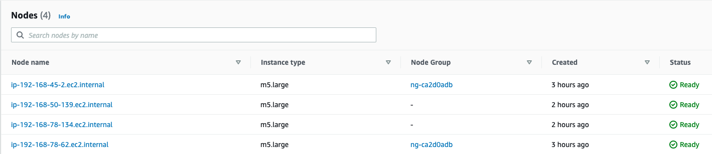
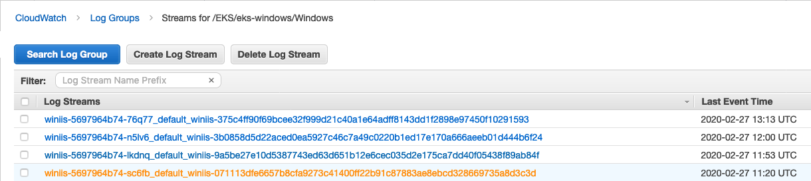
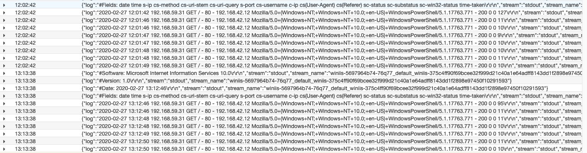

# k8s-fluentd-windows
Stream Logs from K8s Windows Pods using Fluentd

## **If you already have an EKS Cluster With Windows, don't forget to replace eks-windows for your cluster name**

## **These examples were created using us-east-1 region**

# Pre requisits:

## 0) Tools
* [awscli](https://docs.aws.amazon.com/cli/latest/userguide/cli-chap-install.html)
* [eksctl](https://docs.aws.amazon.com/eks/latest/userguide/getting-started-eksctl.html)
* [kubectl](https://docs.aws.amazon.com/eks/latest/userguide/install-kubectl.html)

## 1) EKS Cluster with Windows Nodes

1.1) Create EKS Cluster
```console
eksctl create cluster --name=eks-windows --ssh-access \
--ssh-public-key=#<your_key_name> --managed --region=us-east-1
```
1.2) Install vpc-controller
```console
eksctl utils install-vpc-controllers --cluster=eks-windows --approve --region=us-east-1
```
1.3) Create Nodegroup Windows
```console
eksctl create nodegroup --cluster=eks-windows --node-ami-family=WindowsServer2019FullContainer \
--ssh-access --ssh-public-key=#<your_key_name> --region=us-east-1
```
1.4) Update your kubectl config
```console
aws eks update-kubeconfig --name eks-windows --region us-east-1
```
**Check the nodes:**
```console
kubectl get nodes
```


## 2) Configure OIDC for EKS

```console
eksctl utils associate-iam-oidc-provider  --cluster eks-windows --approve --region us-east-1
```
[Check the OIDC](https://console.aws.amazon.com/iam/home#/providers)


# Install fluentd-windows EKS

## 1) Create EKS [Service Account](https://docs.aws.amazon.com/eks/latest/userguide/iam-roles-for-service-accounts.html)

```console
eksctl create iamserviceaccount --cluster eks-windows \
--attach-policy-arn arn:aws:iam::aws:policy/CloudWatchFullAccess \
--name fluentd-windows --namespace amazon-cloudwatch --approve \
--region us-east-1
```

```console
kubectl get sa -n amazon-cloudwatch | grep fluentd-windows
```

## 2) Deploy fluentd-windows Configmap and Daemonset

```console
kubectl apply -f https://raw.githubusercontent.com/bgsilvait/k8s-fluentd-windows/master/k8s/configmap-fluentd-windowsbgs.yaml
```

**If you are NOT using the provided examples for AWS_REGION and Cluster Name, you should replace on configmap-fluentd-windowsbgs.yaml:**

```yaml
data:
  AWS_REGION: YOUR_REGION_HERE
  CLUSTER_NAME: YOUR_CLUSTER_NAME
  fluent.conf: |
```

```console
kubectl apply -f https://raw.githubusercontent.com/bgsilvait/k8s-fluentd-windows/master/k8s/daemonset-fluentd-windows.yaml
```

```console
kubectl get pods -n amazon-cloudwatch
```

### **Windows containers are bigger than linux, can take some minutes to enter in ready state.**

## 3) Deploy an IIS pod created with [Logmonitor](https://github.com/microsoft/windows-container-tools/tree/master/LogMonitor)


```console
kubectl apply -f https://https://raw.githubusercontent.com/bgsilvait/k8s-fluentd-windows/master/k8s/deployment-iisbgs.yaml
```

```console
kubectl get pods -A -o wide | grep winiis
```


## 4) Access the IIS Pods to generate logs

```console
kubectl -it exec <your_winiis_pod_name> powershell
```

```powershell
curl -I winiis
```
**OR**

```powershell
curl winiis -UseBasicParsing
```


[Cloudwatch (us-east-1)](https://console.aws.amazon.com/cloudwatch/home?region=us-east-1#logStream:group=/EKS/eks-windows/Windows;streamFilter=typeLogStreamPrefix
)





## Custom Containers Windows Server 2019 for IIS and Fluentd 

* [IIS](https://github.com/bgsilvait/k8s-fluentd-windows/tree/master/iis)

* [Fluentd](https://github.com/bgsilvait/k8s-fluentd-windows/tree/master/fluentd)

## Custom Containers Windows Server 1919 for IIS, Fluentd and Kubernetes files

* [IIS](https://github.com/bgsilvait/k8s-fluentd-windows/tree/master/ws1909/iis)

* [Fluentd](https://github.com/bgsilvait/k8s-fluentd-windows/tree/master/ws1909/fluentd)

* [K8S](https://github.com/bgsilvait/k8s-fluentd-windows/tree/master/ws1909/k8s)
