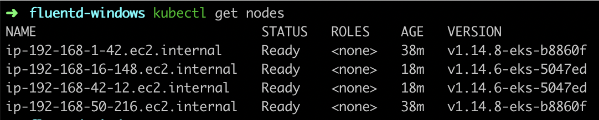

# k8s-fluentd-windows
Stream Logs from K8s Windows Pods using Fluentd

# Pre requisits:

## 0) Tools
* [awscli](https://docs.aws.amazon.com/cli/latest/userguide/cli-chap-install.html)
* [eksctl](https://docs.aws.amazon.com/eks/latest/userguide/getting-started-eksctl.html)
* [kubectl](https://docs.aws.amazon.com/eks/latest/userguide/install-kubectl.html)

## 1) EKS Cluster with Windows Nodes

1.1) Create EKS Cluster
```console
eksctl create cluster --name=eks-windows --ssh-access \
--ssh-public-key=your_key_name --managed --region=us-east-1
```
1.2) Install vpc-controller
```console
eksctl utils install-vpc-controllers --cluster=eks-windows --approve --region=us-east-1
```
1.3) Create Nodegroup Windows
```console
eksctl create nodegroup --cluster=eks-windows --node-ami-family=WindowsServer2019FullContainer --ssh-access --ssh-public-key=your_key_name --region=us-east-1
```
1.4) Update your kubectl config
```console
aws eks update-kubeconfig --name eks-windows --region us-east-1
```
**Check the nodes:**
```console
kubectl get nodes
```


## 2) Configure OIDC for EKS

```console
eksctl utils associate-iam-oidc-provider --region us-east-1 --cluster eks-windows --approve
```
[Check the OIDC](https://console.aws.amazon.com/iam/home#/providers)

## 3) Adicional Windows Server 2019 with Docker for build your containers.(You can use the examples provided)

# Install fluentd-windows EKS

## 1) Create EKS service account

```
eksctl create iamserviceaccount --cluster eks-windows \
--attach-policy-arn arn:aws:iam::aws:policy/CloudWatchFullAccess \
--name fluentd-windows --region us-east-1 \
--namespace amazon-cloudwatch --approve
```

**Expected result:**
```
kubectl get sa -n amazon-cloudwatch | grep fluentd-windows
fluentd-windows   1         
```

Apply the Daemonset 

(replace AWS_REGION and CLUSTERNAME with your config)

